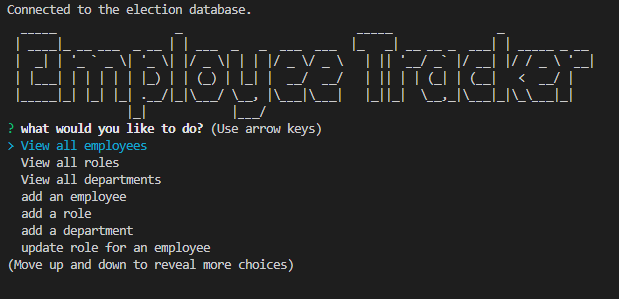

# employee-tracker
  ## Badges
  
  
  ## Table of Contents
  * [License](#license)
  * [Built With](#built-with) 
  * [Description](#description)
  * [Installation](#installation)
  * [Usage](#usage)
  * [How to Contribute](#how-to-contribute)
  * [Tests](#tests)
  * [Questions?](#questions)
  
  ## License
  Read more about MIT here:
  [MIT](https://opensource.org/licenses/MIT)

  ## Built With
  * Node.js
  * MYSQL
  * Inquierer
  * JavaScript
  
  ## Description
  This application was created to manage a company's employee database. Built with MYSQL and leveraging the modular structure of the Employee Tracker, it can scale with a companies growth without the need to rebuild the database. The application allows a member of the company to view all employees, roles, as well as departments. Is also allows for adding employees, roles, departments and updating employees all from the CLI. 

  
  
  ## Installation
  Clone the project. Run "npm i" in your terminal to install necessary packages. 
  
  ## Usage
  After package installation, run "node server.js" in your terminal to start the prompts.

[Link to Demo](https://youtu.be/7xqe20-4yT0)
  
  ## How to Contribute
  [Contributor Covenant](https://www.contributor-covenant.org/)  
  Not Applicable
  
  ## Tests
  Not Applicable
  
  ## Questions?
  ### Reach me here: 
  [erbeard](https://github.com/erbeard)  
  sample@sample.com
